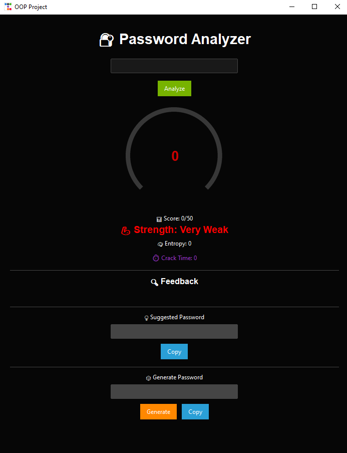

# 🔐 Password Strength Analyzer

A Python GUI tool that analyzes password strength, detects weak patterns, and suggests stronger passwords.

---

## 🚀 Features
- Password strength meter (0–50)
- Entropy calculation
- Crack time estimation
- Dataset checking (common passwords, names, dictionary)
- Smart password suggestions
- Random password generator
- Modern GUI (ttkbootstrap)

---

## 🛠️ Tech Stack
- Python
- Tkinter
- ttkbootstrap
- OOP

---

## 📸 Screenshot


---

## ▶️ Run Project
```bash
pip install ttkbootstrap
python main.py